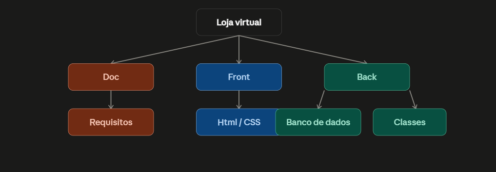

# - O que difere um "Projeto de Software" de um "Script/Código isolado"?
Um script isolado é meio que algo mais objetivo e pontual, geralmente ele resolve só uma tarefa e não precisa muito de manutenção e coisas do tipo
O projeto de software é mais planejado, versionamento, é mais testado, e pensado pra ser usado por outras pessoas

# Ciclo de Vida Básico
- Levantamento de Requisitos/Escopo: entender o que o cliente precisa antes
- Desenvolvimento/Codificação: escrever o código
- Testes/Qualidade: verificar se tudo funciona como o esperado
- Entrega/Implantação: colocar no ar e entregar pro cliente

# Por que escopo fechado é importante?
Porque evita um escopo aumentado no meio do projeto, que chama "scope creep", isso causa atraso, retrabalho e pode estourar o prazo ou o orçamento

# Pesquisa Autônoma (EAP):
Pergunta para Pesquisa/IA: "O que é uma EAP (Estrutura Analítica de Projeto) simplificada para desenvolvimento de software e qual a diferença entre uma EAP e uma lista de tarefas?"
A EAP (Estrutura Analítica de Projeto) é uma ferramenta que decompõe um projeto em partes menores e mais fáceis de gerenciar. No desenvolvimento de software, ela organiza o trabalho de forma hierárquica, dividindo o projeto em grandes módulos (como Documentação, Front-End, Back-End e Banco de Dados) e subdividindo cada módulo em tarefas técnicas específicas. O objetivo é transformar algo amplo em entregas concretas e mensuráveis.
# Diferença entre EAP e Lista de Tarefas
A EAP é hierárquica e organizacional, mostrando os módulos e subdivisões do projeto de forma macro. A lista de tarefas é linear e operacional, usada no dia a dia para executar o que foi planejado. Resumindo: a EAP planeja, a lista de tarefas executa.

# Wireframes

